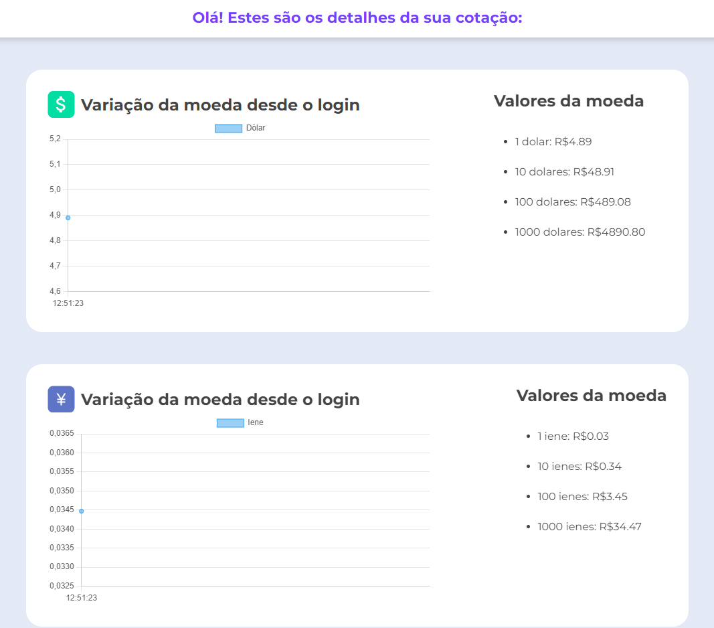
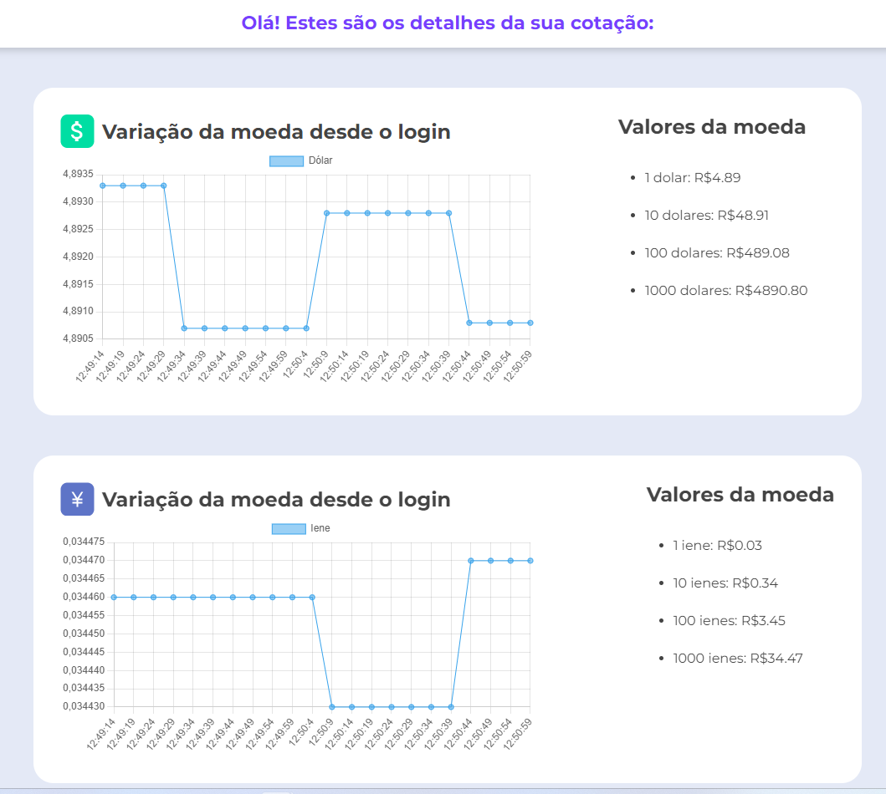

# ByteBank Cotação

Projeto de monitoramento de cotação de moedas no ByteBank.

# Visual do projeto

  

## Sumário

- [Tecnologias Utilizadas](#tecnologias-utilizadas)
- [Status](#status)
- [Descrição](#descrição)
- [Funcionalidades](#funcionalidades)
- [Como Usar](#como-usar)
- [Estrutura do Projeto](#estrutura-do-projeto)
- [Autor](#autor)

## Tecnologias Utilizadas

  

    
  

  

    
  

  

    
  

## Status

<!--  -->

## Descrição

Este é um projeto simples em HTML, CSS e JavaScript que exibe a variação e valores de cotação de duas moedas (dólar e iene) no ByteBank.

## Funcionalidades

- Exibe gráficos de variação de moeda desde o login.
- Mostra os valores da moeda em diferentes multiplicadores (1, 10, 100, 1000).

  

## Como Usar

Basta abrir o arquivo `index.html` em um navegador para visualizar as informações de cotação. Os gráficos são gerados usando a biblioteca Chart.js.

## Estrutura do Projeto

- `styles.css`: Arquivo CSS contendo estilos para a página.
- `script/scripts.js`: Arquivo JavaScript com funções para manipulação da cotação.

## Autor

Desenvolvido por Diego Franco.
